# 🏗️ System Architecture

Estat Ingest Server는 **"고속 수집(High Throughput)"**과 **"안정적 적재(Reliability)"**라는 두 가지 목표를 달성하기 위해, 역할이 명확히 분리된 **파이프라인 아키텍처**를 채택했습니다.

---

## 1. High-Level Blueprint

전체 데이터 흐름은 **"수집(Ingest) → 버퍼링(Buffer) → 처리(Worker) → 저장(Storage)"**의 단방향 흐름을 따르며, 실패 시에만 **복구(Recovery)** 루프를 돕니다.

```mermaid
flowchart LR
    %% 스타일 정의
    classDef client fill:#fff,stroke:#333,stroke-width:1px;
    classDef component fill:#F3E5F5,stroke:#4A148C,stroke-width:2px;
    classDef buffer fill:#FFF3E0,stroke:#E65100,stroke-width:2px,stroke-dasharray: 5 5;
    classDef storage fill:#E1F5FE,stroke:#01579B,stroke-width:2px;
    classDef failure fill:#FFEBEE,stroke:#C62828,stroke-width:2px;
    classDef resource fill:#ECEFF1,stroke:#546E7A,stroke-width:1px,stroke-dasharray: 3 3;

    Client([Client]) -->|"POST /collect"| Handler[HTTP Handler]

    %% ==========================================
    %% 1. Ingest Server (Core Logic)
    %% ==========================================
    subgraph Server [Estat Ingest Server]
        direction LR
        
        %% Resource
        Handler -.-|"Get Event"| Pool[["sync.Pool"]]:::resource

        %% Main Pipeline
        Handler -->|"Push"| Eq{{"Event Queue"}}:::buffer
        Eq -->|"Batching"| CLoop[Collect Worker]:::component
        CLoop -->|"Flush"| Uq{{"Upload Queue"}}:::buffer
        Uq -->|"Consume"| ULoop[Upload Worker]:::component
        
        %% 처리 단계
        ULoop -->|"Encode (Gzip)"| Enc[Encoder]:::component
        Enc -->|"Attempt Upload"| Try{"Success?"}
        
        %% 실패 시 저장 (Failover)
        Try -->|"No (Fail)"| Save[Save to Disk]:::failure
        Save --> Disk[("/tmp/dlq")]:::failure
        
        %% 복구 로직 (Recovery)
        Disk -->|"Partial Scan"| Recover[Recovery Logic]:::component
        Recover -->|"Validate"| Val{"Valid JSON?"}
    end

    %% ==========================================
    %% 2. External Storage (AWS S3)
    %% ==========================================
    subgraph AWS [AWS S3 Storage]
        Raw[(S3 RAW Bucket)]:::storage
        Bad[(S3 DLQ Prefix)]:::storage
    end

    %% --- 연결선 ---
    
    %% 성공 케이스 (굵은 선)
    Try ==>|"Yes"| Raw
    
    %% 복구 케이스
    Val -->|"Yes (Recovered)"| Raw
    Val -->|"No (Corrupt)"| Bad
    
    %% 루프 트리거 (점선)
    ULoop -.->|"Trigger Retry"| Recover

    %% 스타일 적용
    class Client client;
    class Handler,CLoop,ULoop,Enc,Recover component;
```

2. Core Components (핵심 구성요소)
🚀 2.1 Ingestion Layer (수집 계층)
HTTP Handler: 클라이언트의 진입점입니다. Content-Length 제한 등 기본적인 유효성 검사를 수행합니다.

Memory Pool (sync.Pool): 요청마다 객체를 생성하지 않고, 미리 할당된 Event 객체를 재사용하여 GC(Garbage Collection) 부하를 "Zero" 수준으로 최소화합니다.

Event Channel (EventCh): 트래픽이 폭주할 때 일시적으로 요청을 담아두는 1차 댐(Dam) 역할을 합니다. 큐가 가득 차면 즉시 503 에러를 반환하여 서버가 다운되는 것을 방지합니다(Backpressure).

⚙️ 2.2 Worker Layer (작업 계층)
Collect Worker: 개별 이벤트를 모아 **배치(Batch)**로 만듭니다. BatchSize(개수) 또는 FlushInterval(시간) 조건 중 하나라도 충족되면 다음 단계로 넘깁니다.

Upload Worker: 배치를 받아 Gzip 압축 + JSONL 변환을 수행하고 S3로 업로드합니다. 가장 많은 CPU 자원을 사용하는 구간입니다.

🛡️ 2.3 Reliability Layer (안정성 계층)
App-Level Retry: AWS SDK의 무거운 재시도 로직 대신, 가볍고 빠른 자체 재시도 루프를 사용합니다.

Circuit Breaker (DLQ): S3 업로드가 실패하면, 데이터를 메모리에 들고 있는 대신 즉시 **로컬 디스크(/tmp/dlq)**에 씁니다. 이를 통해 서버 메모리 고갈을 막고 데이터 유실을 방지합니다.