# 🏛️ System Architecture & Design Decisions  
**Estat Ingest Server — Architecture Document**

이 문서는 Estat Ingest Server의 **전체 구조**, **핵심 컴포넌트**, 그리고  
**왜 이 설계를 선택했는지(Design Rationale)** 를 설명합니다.

- 처리 흐름(파이프라인) 상세: `docs/pipeline.md`
- DLQ 복구 알고리즘: `docs/dlq.md`
- Graceful Shutdown 전략: `docs/shutdown.md`
- 성능 튜닝 및 운영: `docs/tuning.md`, `docs/ops.md`

---

## 1. 🎯 아키텍처 목표 (Architecture Goals)

Estat Ingest Server는 다음 목표를 기반으로 설계되었습니다.

### 1) High Throughput (고성능 처리)

- Go의 Goroutine + Channel 기반 병렬 처리
- 이벤트를 배치로 묶어(S3 PutObject 호출 수 감소) 처리 효율 극대화
- Fargate 0.25~0.5 vCPU 환경에서도 수천 TPS 처리 목표

### 2) Predictable Resource Usage (예측 가능한 자원 사용)

- `sync.Pool`을 통한 Event/버퍼 재사용으로 GC Pause 최소화
- 고정된 개수의 워커(특히 UploadLoop)로 CPU 폭주 방지
- 파이프라인 각 단계의 책임이 분리되어 병목 지점을 쉽게 추적 가능

### 3) High Reliability (장애 상황에서도 데이터 보호)

- S3 업로드 실패 시 로컬 DLQ에 저장
- DLQ 복구 시 Partial Scan(O(K)) 알고리즘으로 서버 부하 제한
- Graceful Shutdown(Drain Pattern)으로 종료 중 데이터 유실 최소화

### 4) Operational Simplicity (운영 단순성)

- Kafka/SQS 등 별도 MQ 없이도 안정적 동작
- 장애 지표(Metrics)가 명확하여 운영·알람 설계가 단순
- 코드 구조가 컴팩트해서 새로운 개발자가 구조를 파악하기 쉬움

---

## 2. 🗺️ 상위 구조 (High-Level Blueprint)

가장 상위 관점에서의 데이터 흐름:

```text
Client → HTTP Handler → EventCh → CollectLoop → UploadCh → UploadLoop → S3 / DLQ
```

레이어 관점에서는 다음과 같이 나눌 수 있습니다.

```text
[Ingest Layer] → [Batch Layer] → [Worker Layer] → [Storage Layer]
```

---

## 3. Top-Level Architecture Diagram

```mermaid
flowchart LR
    classDef comp fill:#F3E5F5,stroke:#4A148C,stroke-width:2px;
    classDef buf fill:#FFF3E0,stroke:#E65100,stroke-width:1.5px,stroke-dasharray:5 5;
    classDef st fill:#E1F5FE,stroke:#01579B,stroke-width:2px;
    classDef fail fill:#FFEBEE,stroke:#C62828,stroke-width:2px;

    Client([Client]) -->|"POST /collect"| Handler[HTTP Handler]:::comp

    subgraph IngestLayer [Ingest Layer]
        Handler -->|"Push Event"| EventCh{{EventCh}}:::buf
    end

    subgraph BatchLayer [Batch Layer]
        EventCh -->|"Pull & Aggregate"| CLoop[CollectLoop<br/>Batch Builder]:::comp
        CLoop -->|"Flush (Size/Interval)"| UploadCh{{UploadCh}}:::buf
    end

    subgraph WorkerLayer [Worker Layer]
        UploadCh -->|"Pull Batch"| ULoop[UploadLoop]:::comp
        ULoop -->|"Encode JSONL + Gzip"| Encoder[Encoder]:::comp
        Encoder -->|"PutObject"| Attempt{"S3 Success?"}
    end

    subgraph StorageLayer [Storage Layer]
        S3Raw[(S3 RAW Bucket)]:::st
        S3Dlq[(S3 DLQ Prefix)]:::st
        LocalDLQ[("/tmp/dlq")]:::st
    end

    Attempt -->|"Success"| S3Raw
    Attempt -->|"Fail"| SaveDLQ[Save Batch to Local DLQ]:::fail
    SaveDLQ --> LocalDLQ

    LocalDLQ -.->|"Idle-Time Retry"| DLQMgr[DLQ Manager]:::comp
    DLQMgr -->|"Validate & Upload"| RetryResult{"Valid JSON?"}
    RetryResult -->|"Valid"| S3Raw
    RetryResult -->|"Corrupt"| S3Dlq
```



---

## 4. 레이어별 상세 설명 (Layer-by-Layer)

### 4.1 Ingest Layer — HTTP 수집

**관련 파일**

- `internal/server/handler.go`
- `internal/model/*`
- `internal/pool/*`

**역할**

- `/collect` HTTP 요청 처리
- Body 크기 제한(`MAX_BODY_SIZE`) 체크
- JSON 문자열을 Event 구조체로 포장 (Event는 `sync.Pool`에서 가져옴)
- EventCh에 비동기로 push

**설계 포인트**

- EventCh가 꽉 차 있는 경우, **즉시 503으로 거절**하여 서버를 보호
- Ingest Layer는 CPU 사용량이 매우 낮도록 설계 (파싱·검증 최소화)

---

### 4.2 Batch Layer — EventCh → UploadCh

**관련 파일**

- `internal/worker/manager.go` (CollectLoop 부분)

**역할**

- EventCh에서 이벤트를 하나씩 pull
- `[]*model.Event` 슬라이스에 batch로 누적
- 두 조건 중 하나를 만족하면 UploadCh로 배치 전송
  - `BATCH_SIZE` 개수 도달
  - `FLUSH_INTERVAL` 시간 경과

**설계 포인트**

- 슬라이스는 매 flush마다 새로 `make` 하여 배치 간 데이터 오염 방지
- CollectLoop는 CPU·메모리 부담이 적어, 실질적인 병목은 Worker Layer에 집중
- Batch Layer는 **“속도 조절 및 그룹화”** 역할에 충실하게 설계

---

### 4.3 Worker Layer — Encoding & Upload & DLQ

**관련 파일**

- `internal/worker/encoder.go`
- `internal/worker/s3_uploader.go`
- `internal/worker/dlq.go`
- `internal/worker/manager.go` (UploadLoop 부분)

**역할**

1. UploadLoop가 UploadCh에서 배치를 가져옴
2. Encoder가:
   - 배치를 JSON Lines(JSONL) 문자열로 직렬화
   - gzip 압축 수행
3. S3Uploader가 S3에 PutObject 호출
4. 업로드 실패 시:
   - 로컬 DLQ 디렉토리(`/tmp/dlq`)에 gzip 파일 + 메타데이터 저장
5. UploadLoop가 **배치 처리가 끝난 뒤 idle 상태일 때**:
   - DLQManager가 DLQ 디렉토리에서 파일을 하나 선택(Partial Scan)
   - 파일 유효성을 검사(gzip + JSON 1줄)
   - RAW 또는 RAW_DLQ Prefix로 업로드 재시도

**설계 포인트**

- WorkerLayer는 전체 시스템의 **CPU·IO 중심 병목 지점**
- UploadLoop는 통상 1개(또는 소수)만 유지해 CPU 사용량을 통제
- DLQManager는 **Partial Scan(O(K))** 으로 DLQ 파일 수와 무관하게 per-iteration 비용을 고정
- DLQ 재처리는 **UploadLoop가 여유 있을 때만 1건씩 처리**하여  
  본래 업로드 경로를 방해하지 않도록 설계

---

## 5. 중요 설계 선택 (Design Decisions)

### 5.1 `sync.Pool` 기반 메모리 재사용

- Event, BodyBuffer, gzip 버퍼 등을 Pool로 관리
- 장점:
  - 메모리 할당/해제 비용 감소
  - GC 빈도 및 Pause Time 감소
- 단점:
  - 타입 사용 규칙이 느슨해지면 데이터 오염 위험 → 특정 용도로만 엄격하게 사용

---

### 5.2 이중 채널 구조: `EventCh` + `UploadCh`

**왜 단일 큐가 아닌가?**

| 채널 | 역할 |
|------|------|
| EventCh | HTTP 수집 → 내부 파이프라인 진입 버퍼 |
| UploadCh | Batch → Upload 작업 큐 |

- HTTP 수집 단계와 업로드 단계를 **명시적으로 분리**해서  
  어느 단계에서 병목이 발생하는지 관찰·조정이 쉽도록 함
- 예:
  - EventCh에서 대기 길어짐 → 수집/CollectLoop 쪽 문제
  - UploadCh에서 대기 길어짐 → 인코딩/업로드 쪽 문제

---

### 5.3 Local DLQ vs 외부 MQ(Kafka, SQS)

이 프로젝트는 **구성 단순성 + 비용 절감**을 목표로, DLQ를 로컬 디스크에 두는 방식을 선택했습니다.

- 장점:
  - Kafka, SQS, Firehose 같은 외부 인프라 없이 동작
  - Fargate Ephemeral Disk 활용 → 별도 비용 없음
- 단점:
  - Task 자체가 종료되면 DLQ 파일도 함께 사라질 수 있음
  - 따라서 **절대적인 무손실을 보장하지는 않으며**,  
    현실적인 범위 안에서 유실 확률을 최대한 낮추는 전략

---

### 5.4 Partial Scan (O(K)) 설계

전통적인 접근:

- `os.ReadDir()`로 전체 목록 읽기 → `sort` → 가장 오래된 파일 선택
- 파일이 N개일 때, 매 반복의 비용이 O(N) 또는 O(N log N)의 디스크/CPU 부하

이 서버의 접근:

- `Readdirnames(1000)`으로 **최대 1000개까지만 읽음 (K=1000)**
- 읽어온 후보들만 대상으로 `sort` 후 가장 오래된 파일 선택
- 장점:
  - DLQ 파일이 1만·10만 개로 늘어나도, **각 시도 비용은 거의 일정하게 유지**
  - 장애 상황에서도 DLQ 처리 로직이 서버를 다시 죽이지 않음
- Trade-off:
  - 항상 “전역에서 가장 오래된 파일”을 선택한다고 보장할 수는 없음
  - 하지만 K=1000 수준이면 실무적으로 기아(starvation) 문제는 거의 없다고 보아도 무방

---

### 5.5 Graceful Shutdown (Drain Pattern)

- 종료 시 가장 중요한 원칙은:

> **“새로운 요청은 받지 않고, 이미 받은 데이터는 끝까지 처리한다.”**

- 구현 방식:
  1. `EventCh`를 닫아 더 이상 이벤트가 들어오지 않게 함
  2. CollectLoop는 EventCh를 비우면서 남은 이벤트들을 모두 Batch로 만들어 UploadCh에 밀어 넣음
  3. CollectLoop 종료 후 UploadCh를 닫음
  4. UploadLoop는 UploadCh가 빌 때까지 모든 배치를 업로드하고 종료
  5. 마지막에 `context.CancelFunc`를 호출해 추가 백그라운드 작업 정리

- 이 과정에서 `context.Context`의 cancel은 **가장 마지막 단계**에서 호출하여,  
  처리 중인 업로드가 `context canceled`로 중간에 잘리는 상황을 피함

자세한 타임라인과 시퀀스 다이어그램은 `docs/shutdown.md` 참고.

---

## 6. 코드 매핑 (Component ↔ File)

| 컴포넌트 | 역할 | 주요 파일 |
|----------|------|-----------|
| HTTP Handler | 수집, Body 크기 제한, Event 생성 | `internal/server/handler.go` |
| Event Pool | Event/버퍼 재사용 | `internal/pool/*` |
| Manager (CollectLoop/UploadLoop) | 파이프라인 전체 수명 주기 관리 | `internal/worker/manager.go` |
| Encoder | JSONL + gzip 인코딩 | `internal/worker/encoder.go` |
| S3Uploader | S3 PutObject + 재시도 정책 | `internal/worker/s3_uploader.go` |
| DLQ Manager | 로컬 DLQ 저장/복구/TTL/용량 관리 | `internal/worker/dlq.go` |
| Metrics | 텍스트 기반 지표 문자열 생성 | `internal/metrics/metrics.go` |

---

## 7. 아키텍처 요약

```text
HTTP → EventCh → CollectLoop → UploadCh → UploadLoop → Encoder → S3
                                    ↘ 실패 → Local DLQ → DLQManager → (복구) → S3
```

이 구조는 다음을 동시에 목표로 합니다.

- **고성능**: 배치 + gzip + S3 업로드 최적화
- **자원 효율**: 낮은 vCPU/메모리 환경에서도 안정 동작
- **신뢰성**: S3 장애·일시적 오류에도 데이터 유실 최소화
- **운영 단순성**: 모니터링 포인트와 병목 지점이 명확

---

### 이어서 읽기

- 처리 단계별 상세 흐름: [`docs/pipeline.md`](pipeline.md)  
- DLQ 알고리즘 상세: [`docs/dlq.md`](dlq.md)  
- Shutdown 전략: [`docs/shutdown.md`](shutdown.md)  
- 성능 튜닝: [`docs/tuning.md`](tuning.md)  
- 운영 매뉴얼: [`docs/ops.md`](ops.md)