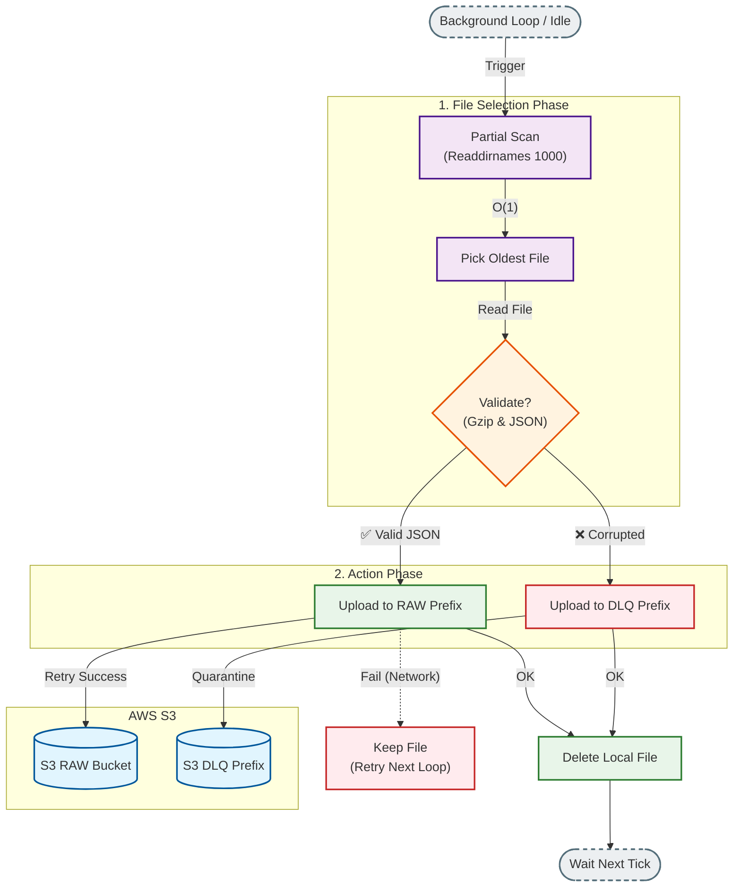

# 🔁 Dead Letter Queue (DLQ) Strategy

S3 장애, 네트워크 단절 등 예측 불가능한 상황에서도 **데이터를 절대 잃어버리지 않기 위한(Zero-loss)** 복구 전략입니다.

---

## 1. Why DLQ? (설계 배경)
AWS S3는 99.99% 가용성을 보장하지만, **0.01%의 장애 순간**이나 **네트워크 타임아웃**은 언제든 발생할 수 있습니다. 이때 메모리에 데이터를 계속 쌓아두면 서버가 OOM(Out of Memory)으로 죽게 됩니다. 따라서 **실패한 데이터는 즉시 디스크로 내리는(Offloading)** 전략이 필수적입니다.

---

## 2. Recovery Logic Visualization

백그라운드에서 동작하는 복구 로직의 흐름도입니다.

---

## 3. Key Algorithms (핵심 알고리즘)

### 🔍 Partial Scan (부분 스캔)
* **문제점**: DLQ에 파일이 10만 개 쌓였을 때 `ReadDir`(전체 읽기)를 하면 CPU와 I/O가 폭발하여 서버가 멈출 수 있습니다.
* **해결책**: `Readdirnames(1000)`을 사용하여 **파일 개수와 상관없이 항상 최대 1,000개만** 읽습니다.
* **효과**: 장애 상황에서도 서버의 부하가 일정하게 유지됩니다(O(1) Complexity).

### ⏳ Anti-Starvation (기아 방지)
* 1,000개의 후보군 내에서 **타임스탬프 기준 가장 오래된 파일**을 우선 처리합니다.
* 파일 시스템의 디렉토리 구조 특성상, 처리된 파일이 삭제되면 새로운 파일이 후보군에 들어오므로 결국 모든 파일이 처리됨을 보장합니다.

### 🧪 Data Validation (무결성 검사)
* 재업로드 전 `gzip` 압축을 풀고 첫 줄이 올바른 JSON인지 검사합니다.
* **정상 파일** → 원래 가야 할 `RAW` 경로로 복구.
* **깨진 파일** → 분석을 위해 `raw_dlq/` 경로로 격리 보관.