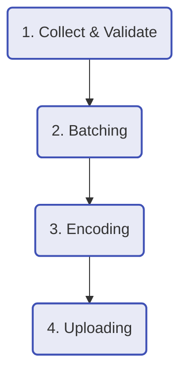

# 🔄 Data Processing Pipeline

Estat Ingest Server 내부에서 단일 로그 이벤트가 처리되는 **4단계 생명주기(Lifecycle)**입니다.

---

## Step 1. Collect & Validate (수집 및 검증)
* **Body Size Check**: `MAX_BODY_SIZE`(기본 16KB)를 초과하는 요청은 `413 Payload Too Large`로 거절하여 메모리 폭발을 방지합니다.
* **IP Extraction**: `X-Forwarded-For` 및 `CloudFront-Viewer-Address` 헤더를 분석하여 실제 클라이언트 IP를 추출합니다.
* **Object Pooling**: `sync.Pool`에서 빈 이벤트 객체를 꺼내 데이터를 채운 뒤 `EventCh`로 보냅니다.

## Step 2. Batching (배치 처리)
* **Hybrid Trigger**: 다음 두 가지 조건 중 하나가 만족되면 배치를 확정(Flush)합니다.
    1.  **Count-based**: 이벤트가 `BATCH_SIZE`(예: 5000개)만큼 모였을 때.
    2.  **Time-based**: 마지막 업로드 이후 `FLUSH_INTERVAL`(예: 2분)이 지났을 때.
* **Safety**: 배치 슬라이스(`[]*Event`)는 매번 새로 할당하여, 이전 배치의 데이터 오염을 원천 차단합니다.

## Step 3. Encoding (압축 및 변환)
* **JSON Lines**: 여러 이벤트를 개행 문자(`\n`)로 구분된 하나의 파일로 합칩니다.
* **Gzip Compression**: `klauspost/compress/gzip` 라이브러리(Standard library보다 빠름)를 사용하여 압축합니다.
* **Resource Reuse**: `gzip.Writer`와 `bytes.Buffer` 역시 풀링하여 CPU와 메모리 사용량을 최적화합니다.

## Step 4. Uploading (전송)
* **Path Generation**: Hive Partitioning 스타일(`dt=YYYY-MM-DD/hr=HH`)로 S3 키를 생성하여, 추후 Athena/Spark 등에서 조회 성능을 높입니다.
* **Failover**: 업로드 실패 시, 재시도(`S3_APP_RETRIES`) 후에도 실패하면 즉시 **DLQ 프로세스**로 이관합니다.