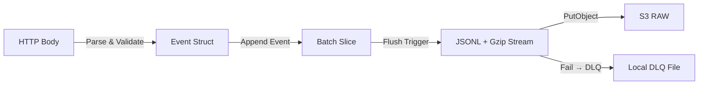
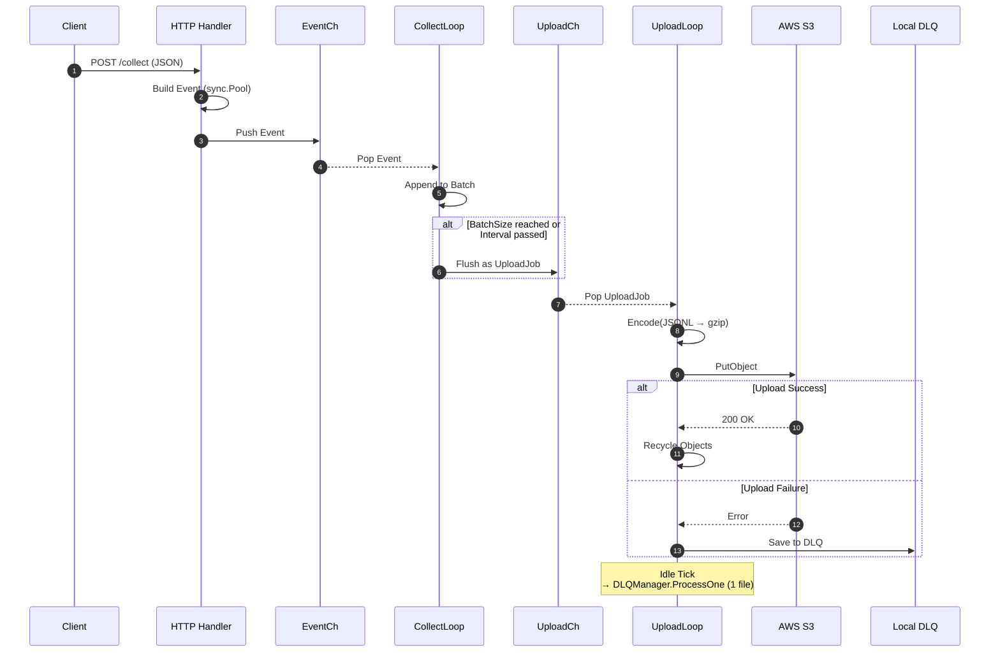
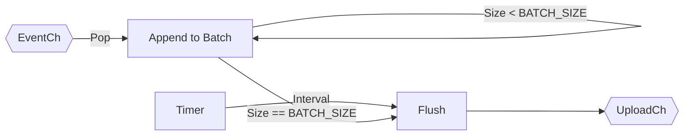
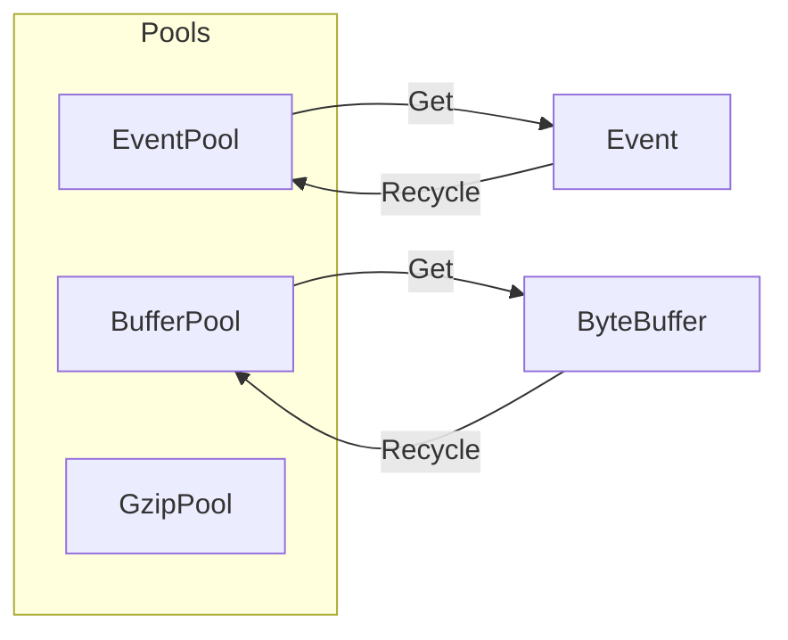
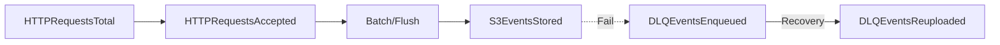

# 🔄 Data Processing Pipeline  
**Estat Ingest Server v1 — Event → Batch → Encode → Upload 전체 흐름 설명**

이 문서는 하나의 이벤트가 서버에 도착한 순간부터  
S3에 저장되거나 DLQ로 우회되는 전 과정의 동작 원리를 설명합니다.

각 레이어의 책임, 제어 흐름, 메모리 흐름을 구조적으로 정리하여  
전체 ingest 파이프라인을 쉽게 이해할 수 있도록 구성했습니다.

---

# 1. 전체 파이프라인 개요

이벤트가 서버 내부에서 이동하는 주요 단계는 다음과 같습니다:

1. **HTTP 수집(Ingestion)**  
2. **Batching(이벤트 묶기)**  
3. **Encoding(JSONL + gzip)**  
4. **Uploading(S3 PutObject)**  
5. **Fallback(DLQ 저장 및 재업로드)**  

### 전체 요약 다이어그램



---

# 2. 이벤트 생명주기(Event Lifecycle)

하나의 이벤트가 ingest 서버 전체를 따라 이동하는 과정입니다.



---

# 3. 단계별 상세 설명

---

## 3.1 HTTP Ingestion

### 입력
- POST `/collect`
- Raw JSON 문자열
- 최대 크기: `MAX_BODY_SIZE` (예: 16KB)

### 주요 작업
1. Body 크기 제한 검사 (`HTTP 413`)
2. JSON 문자열을 **그대로 저장** (파싱하지 않음)
3. EventPool에서 Event 객체를 받아 필드 작성
4. EventCh에 push (비동기)

### 설계 의도
- JSON 파싱 비용 제거 → CPU 사용 최소화
- Event 객체/버퍼를 `sync.Pool`에서 재사용 → 메모리 효율 강화

---

## 3.2 Batching (EventCh → CollectLoop)

CollectLoop는 EventCh에서 이벤트를 하나씩 가져와 batch로 묶습니다.

### Batch 생성 조건

| 조건 | 설명 |
|------|------|
| BatchSize 도달 | 고부하 시 flush가 빠르게 발생 |
| FlushInterval 경과 | 저부하 시 배치가 쌓이지 않도록 강제 flush |

### 데이터 흐름



### 메모리 동작
- flush 후 **새로운 slice를 생성** (`make([]*Event)`)
- slice 재사용은 이벤트 간 데이터 오염 위험이 있어 배제

---

## 3.3 Encoding (JSONL + gzip)

### JSON Lines 직렬화

배치 내 이벤트를 JSONL 형식으로 변환합니다.

```
{"ts":1700000000,"body":"..."}
{"ts":1700000001,"body":"..."}
```

### gzip 압축
- `gzip.Writer`로 스트리밍 압축 수행
- footer가 생성되기 전에 프로세스가 종료되면 파일이 손상되므로  
  **Graceful Shutdown이 매우 중요**

### Pseudo-code

```go
func EncodeBatch(events []*Event) ([]byte, error) {
    buf := bufferPool.Get()
    gz := gzipPool.GetWriter(buf)

    for _, ev := range events {
        gz.Write(ev.Body)
        gz.Write([]byte("\n"))
    }

    gz.Close()
    return buf.Bytes(), nil
}
```

---

## 3.4 Uploading (S3 PutObject)

### 성공 흐름

- `s3_events_stored_total += numEvents`
- Event 객체, 바이트 버퍼, gzip writer 등 모두 Pool로 반환

### 실패 흐름

- DLQ에 `{data.gz, meta.json}` 저장
- 실패한 배치는 추후 재처리 대상
- UploadLoop는 **idle 시 1건씩만** DLQ 재업로드를 시도함  
  → UploadCh가 밀려 있을 때 DLQ가 과도하게 CPU를 차지하지 않음

### 재시도 정책

- AWS SDK retry = **0회(고정)**  
- **애플리케이션 레벨에서만** 재시도 (`S3_APP_RETRIES`)
- 이유:
  - AWS SDK retry backoff는 업로드 시간을 과도하게 늘려  
    내부 파이프라인이 막히는 원인이 될 수 있음

---

# 4. 제어 흐름(Control Flow)

### Goroutine 구성

```
HTTP Server goroutine
CollectLoop goroutine
UploadLoop goroutine
```

각 goroutine은 채널을 기반으로 독립적인 책임을 가지며,  
상호 간 공유 자원 접근은 거의 존재하지 않습니다.

---

### Backpressure (Fail-Fast) 메커니즘

- UploadLoop 처리 속도가 느려지면 UploadCh가 채워짐  
- CollectLoop는 UploadCh가 가득 차면 flush에 걸려 느려짐  
- EventCh까지 밀리면 HTTP Handler가 이벤트를 push하지 못하고 **즉시 503 반환**
- 서버는 죽지 않고 upstream에게 과부하를 명확히 알림

이 구조는 부하 상황에서 **안정적인 동작을 보장하는 핵심 설계**입니다.

---

# 5. 메모리 흐름(Memory Flow)



- Event, Buffer, gzip Writer는 모두 Pool을 통해 재사용  
- 메모리 할당/해제 비용 감소 → GC 부담 완화

---

# 6. 실패 흐름(Failure Handling)

| 실패 원인 | 처리 방식 | 최종 결과 |
|-----------|-----------|------------|
| 요청 Body Too Large | 413 반환 | metrics 증가 |
| EventCh Full | 503 반환 | Fail-Fast 작동 |
| Encoding Error | Raw_DLQ Prefix 업로드 | 원본 JSON 보존 |
| S3 Timeout/Fail | DLQ 저장 | 재시도 |
| DLQ Save Error | Drop | metrics 증가 |

Failure path는 모두 metrics에 반영되며 운영자가 쉽게 문제를 파악할 수 있습니다.

---

# 7. 관측 흐름(Observability Flow)



파이프라인의 정상/장애 상태가 이 지표들만으로도 명확히 드러납니다.

---

# 8. 동작 요약

```
Raw Event
 → Parse
 → EventCh
 → Batch
 → JSONL
 → gzip
 → S3 Upload
 → (Fail → DLQ Save → Idle-Time Retry)
```

핵심 요소는 다음과 같습니다:

1. 단순하고 예측 가능한 단계 구성  
2. 고부하에서도 Fail-Fast 기반의 안정적인 backpressure  
3. S3 장애 시 DLQ 기반 저장 + idle-time 자동 복구  

---

# 참고 문서

- DLQ 상세 전략: `docs/dlq.md`
- Shutdown 설계: `docs/shutdown.md`
- 운영 & 튜닝 가이드: `docs/ops.md`, `docs/tuning.md`