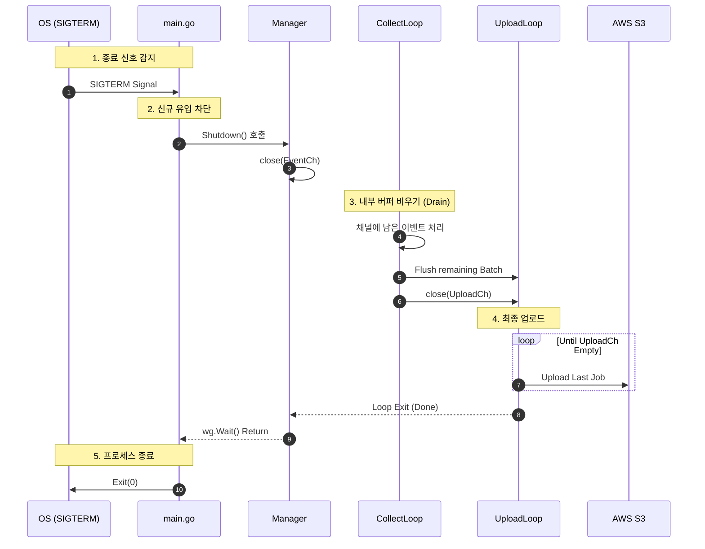

# 🛑 Graceful Shutdown Strategy

ECS/Fargate의 스케일인(Scale-in)이나 배포 시, **처리 중이던 데이터를 단 하나도 잃지 않고(Zero-loss)** 종료하기 위한 **Drain Pattern**입니다.

---

## Shutdown Sequence

## 핵심 원칙
1.  **입구 먼저 닫기**: `EventCh`를 먼저 닫아 더 이상 물이 들어오지 않게 합니다.
2.  **강제 종료 금지**: `Context.Cancel()`을 바로 호출하지 않고, 내부 고루틴들이 하던 일을 마칠 때까지(`sync.WaitGroup`) 기다립니다.
3.  **순차적 종료**: `CollectLoop`가 끝나야 `UploadLoop`가 끝나는 의존 관계를 가집니다.