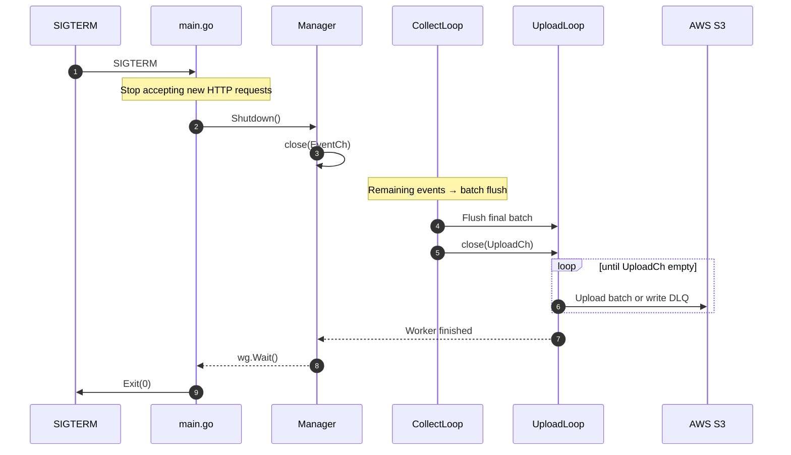
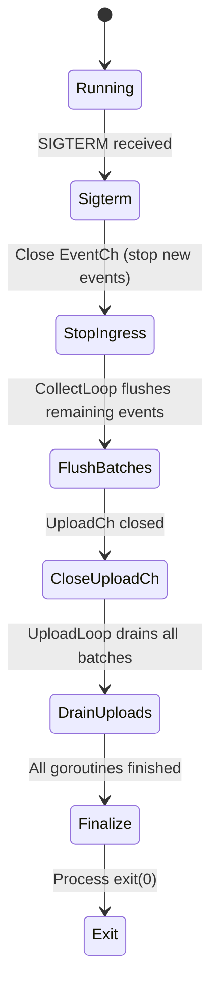

# 🛑 Graceful Shutdown Strategy  
**Safe Termination · Zero-Batch-Loss Design · Predictable Behavior Under Stop**

Graceful Shutdown은 서버가 **종료 신호(SIGTERM)** 를 받았을 때,  
이미 수집된 데이터를 **유실 없이(S3 업로드 또는 DLQ 저장까지 보장)** 처리하기 위한 메커니즘입니다.

이 문서는 다음을 설명합니다.

- Shutdown 시 어떤 위험이 발생하는지  
- 왜 특정 순서로 종료해야 하는지  
- UploadLoop / CollectLoop / DLQManager 와의 상호작용  
- Fargate Stop → SIGTERM → SIGKILL 흐름  
- 안전한 종료를 위한 설계 근거  

---

# 1. Shutdown이 중요한 이유

서버가 종료될 때 다음 문제가 발생할 수 있습니다.

| 위험 | 설명 |
|------|------|
| **업로드 중단** | S3 업로드가 진행 중일 때 `context canceled` 발생 → gzip 스트림 또는 업로드가 중단 |
| **DLQ 파일 손상** | gzip footer 기록 전 종료되면 gzip 파일이 불완전한 상태로 남음 |
| **배치 유실** | EventCh 또는 UploadCh 내부의 데이터가 flush 되기 전에 프로세스 종료 |
| **goroutine 조기 종료** | cancel을 너무 일찍 호출하면 UploadLoop·CollectLoop가 중간 상태에서 종료 |

즉, shutdown 과정에서 **잘못된 순서**로 종료하면 *데이터 유실이 발생할 수 있습니다.*

---

# 2. Fargate 종료 타임라인

Fargate는 다음과 같은 순서로 종료를 진행합니다.

```
Task Stop → SIGTERM → (최대 30초 유예기간) → SIGKILL
```

| 시점 | 설명 |
|------|------|
| **T=0s** | ECS가 Task Stop 명령 발행 |
| **T=0.1s** | 컨테이너 프로세스에 SIGTERM 전달 |
| **T=0~30s** | 애플리케이션이 graceful shutdown 수행 가능한 시간 |
| **T=30s** | Graceful 여부와 관계없이 SIGKILL 강제 종료 |

**즉, ingest 서버는 30초 안에 모든 배치 / 업로드 / DLQ 저장을 마쳐야 합니다.**

---

# 3. Shutdown Sequence (정확한 종료 순서)

아래는 ingest 서버가 shutdown 시 따라야 하는 정해진 흐름입니다.



---

# 4. 왜 이 순서인가? (중요 설계 근거)

Shutdown 순서가 어긋나면 데이터가 유실된다.  
중요한 근거 2가지를 정리한다.

---

## 4.1 `cancel()`을 먼저 호출하면 안 되는 이유

잘못된 패턴:

```
cancel()
close(EventCh)
close(UploadCh)
```

문제점:

- UploadLoop는 `ctx.Done()` 을 먼저 감지하고 즉시 종료  
- CollectLoop는 flush 중인데 UploadLoop가 이미 종료됨  
  → UploadCh로 전달되지 못한 batch **유실 발생**
- gzip 인코딩 중이던 batch는 미완성 상태로 종료 가능  

**정답: cancel은 맨 마지막에 실행되어야 한다.**

---

## 4.2 채널 닫기 순서가 중요한 이유

올바른 순서:

1) **EventCh → ingress 차단**  
2) **UploadCh → 모든 batch flush 후 닫기**  
3) **UploadLoop 완료 대기**

잘못된 순서 예:

```
close(UploadCh)
close(EventCh)
```

→ CollectLoop가 UploadCh에 쓰려고 하는 순간 panic 발생 (`send on closed channel`)

---

# 5. Shutdown State Diagram



---

# 6. Shutdown 중 발생할 수 있는 실패 시나리오

| 위험 요소 | 설명 | 위험도 |
|----------|------|--------|
| **SIGKILL 도착** | 30초 제한 내 처리 미완료 | 매우 높음 |
| **대형 배치 인코딩 중** | gzip 압축 시간이 길어져 timeout 가능 | 중간 |
| **S3 지연 증가** | PutObject 시간이 길어져 전체 drain 지연 | 높음 |
| **DLQ 저장 중 디스크 부족** | 남은 배치를 DLQ에 저장하지 못함 | 높음 |

※ UploadLoop는 shutdown 중에도 *DLQ 복구를 진행하지 않는다.*  
Shutdown에서는 **현재 남아 있는 배치를 S3/DLQ에 저장하는 것이 최우선**이기 때문이다.

---

# 7. 운영 가이드 (Shutdown 전 점검)

### Shutdown 중 위험 신호
- DLQ 파일이 많음 (`dlq_files_current > 1000`)
- S3 업로드 오류 증가(`s3_put_errors_total ↑`)
- CPU 사용률이 높아 gzip이 느려지는 상황
- UploadCh backlog 증가

### 운영자가 배포 전 체크해야 할 항목
1. DLQ 디렉토리가 과도하게 쌓여 있지 않은지  
2. 현재 ingest 속도 대비 batch flush 시간이 지나치게 길지 않은지  
3. S3 latency가 정상인지  
4. 장애 상황(S3 오류, 네트워크 불안정)이 아닌지  

→ Shutdown 중에는 DLQ 복구가 비활성화되므로,  
**남아 있는 배치 처리에 모든 시간이 쓰여야 한다.**

---

# 8. Shutdown 검증 체크리스트

| 테스트 항목 | 목적 |
|--------------|-------|
| SIGTERM 후 30초 내 종료 | Fargate 환경에서 정상 Drain 보장 |
| S3 응답 지연 환경 테스트 | 업로드 지연이 Drain에 미치는 영향 확인 |
| 배치 크기 조절 테스트 | Batch size가 shutdown 시간에 미치는 영향 확인 |
| DLQ 디스크 부족 상황 | Save 실패 로직 및 metrics 확인 |

---

# 9. Summary

Graceful Shutdown의 핵심은 다음 세 가지이다:

### 1) **새로운 이벤트는 받지 않는다 (Ingress 차단)**  
### 2) **이미 받은 이벤트는 모두 배치로 flush 후 업로드/저장한다**  
### 3) **모든 goroutine이 종료될 때까지 기다린 뒤 cancel()을 호출한다**

이 절차는 ingest 서버가 **종료 중에도 데이터 유실을 최소화하도록 보장**한다.