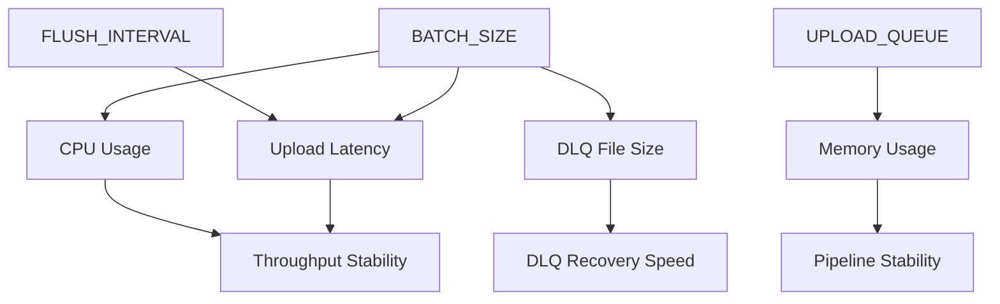

# ⚡ Performance Tuning Guide  
**Estat Ingest Server — Throughput · CPU · DLQ 기반 튜닝 전략**

이 문서는 Estat Ingest Server의 핵심 튜닝 포인트를  
**TPS(초당 이벤트량)**, **CPU 사용률**, **메모리 사용량**, **DLQ 증가 속도** 관점에서 정리한 가이드입니다.

튜닝은 단순히 숫자를 조정하는 것이 아니라,  
**Batch Size → Gzip CPU → Upload Throughput → DLQ → Backpressure**  
로 이어지는 연쇄적 상호작용을 이해하는 과정입니다.

---

# 1. 📈 TPS 기반 초기 설정표 (Traffic-based Tuning Matrix)

아래 표는 실제 운영 환경 기준으로 가장 안정적인 조합을 제시한다.

| 예상 TPS | Batch Size | Flush Interval | vCPU(Fargate) | 참고 |
|---------|------------|----------------|---------------|------|
| **Low (~500)** | 5000 | 120s | 0.25 | gzip 효율 ↑ / S3 비용 ↓ |
| **Moderate (~1000)** | 3000–5000 | 60–120s | 0.5 | 가장 균형적 |
| **High (~2000)** | 2000–3000 | 30–60s | 0.5–1.0 | CPU spike 완화 필요 |
| **Very High (3000+)** | 1000–2000 | 15–45s | 1.0+ | DLQ 증가 속도 주의 |

---

# 2. 🔧 핵심 튜닝 파라미터 이해

---

## 2.1 `BATCH_SIZE`  
### 시스템 전체 동작에 가장 영향을 주는 변수

**Batch Size ↑ (큰 배치)**  
- 👍 S3 요청 횟수 감소  
- 👍 gzip 압축 효율 증가  
- 👎 인코딩 순간 CPU spike 증가  
- 👎 DLQ 파일 1건 크기 증가 → 복구 처리 부담 증가  

**Batch Size ↓ (작은 배치)**  
- 👍 CPU 사용률 안정  
- 👍 DLQ 파일 작아 재업로드 빠름  
- 👎 S3 요청 횟수 증가 → 비용 증가 가능  

➡ **운영 권장:** CPU 사용률 70% 이하 유지하면서 BatchSize 조정

---

## 2.2 `FLUSH_INTERVAL`  
Batch Size에 도달하지 않아도 강제 flush가 발생하는 시간 트리거.

- 트래픽이 일정하지 않은 환경에서 중요  
- Interval이 너무 짧으면 gzip 호출 빈도 증가 → CPU 부담  
- Interval이 너무 길면 저부하 구간에서 데이터가 오래 대기  

**추천값**  
- 0–500 TPS: 120s  
- 1000+ TPS: 30–60s  

---

## 2.3 `UPLOAD_QUEUE`

CollectLoop → UploadLoop 사이의 완충 버퍼.

- 너무 크면 메모리 낭비  
- 너무 작으면 쉽게 EventCh Full → 503 증가  

**권장값**  
- CPU 0.25–0.5 vCPU: `2`  
- CPU 여유가 있을 때만 `4` 사용  

---

## 2.4 `GOMAXPROCS`

- 0.25–0.5 vCPU: `1` 지정 권장  
- 1 vCPU 이상: 기본값(auto) 유지  

---

## 2.5 `S3_APP_RETRIES`

AWS SDK Retry는 항상 0.  
재시도는 애플리케이션이 직접 제어해야 upload latency 예측 가능.

- 권장: 1–2  
- 지나치게 높으면 DLQ 전환 지연  
- 지나치게 낮으면 일시적 네트워크 변화에 취약  

---

# 3. 🧠 메모리 최적화 전략

### ✔ Pool(Event/Buffer/Gzip) 효율성 유지 조건
효율이 떨어지는 케이스:

- BatchSize가 지나치게 작아 flush가 너무 자주 일어나고  
- BatchSize가 지나치게 커서 slice 크기가 불필요하게 커지고  

➡ **권장 BatchSize:** 1000–5000 범위  

---

### ✔ DLQ 쓰기 성능은 CPU보다 느린 I/O  
DLQ 증가 = CPU 부족이 아니라 “업로드 병목”이라는 강력한 신호.  
CPU 튜닝보다 **S3 업로드 지연 원인 파악**이 우선.

---

# 4. 🔗 파라미터 상관관계 (Relationship Diagram)

아래는 시스템 내 핵심 파라미터의 상호작용을 표현한 구조도다:

**핵심 해석:**  
- BatchSize는 CPU·DLQ·Latency에 가장 큰 영향  
- FlushInterval은 latency 특성과 직결  
- UploadQueue는 memory & backpressure 패턴과 연결  

---

# 5. 🧪 Practical Tuning Checklist  
장애가 보이는 상황에서 “무엇을 먼저 조정해야 하는가?”

---

## ① CPU 사용률 > 70%  
→ BatchSize 감소(5000 → 3000 → 2000)  
→ gzip CPU spike 완화  

---

## ② DLQ 증가  
→ S3 지연 또는 AWS 장애 가능성  
→ FlushInterval 약간 단축  
→ UploadLoop idle 상태에서 DLQ는 **1건씩만** 처리하므로  
   DLQ 증가 속도는 업로드 실패율에 직접 비례  

---

## ③ 503 증가(EventCh Full)  
→ UploadLoop 처리 속도가 수집 속도보다 느림  
- BatchSize 감소  
- Task scale-out  
- UploadQueue(4→2) 조정  

---

## ④ 메모리 사용률 증가  
→ UploadQueue 감소(4 → 2)  
→ BatchSize 조정  

---

# 6. 📌 Recommended Defaults

| 항목 | 기본값 | 설명 |
|------|--------|------|
| `BATCH_SIZE` | 3000–5000 | TPS 기준 조정 |
| `FLUSH_INTERVAL` | 60–120s | 저부하 환경에서 효율 ↑ |
| `UPLOAD_QUEUE` | 4 | 메모리 부족 시 2 |
| `S3_APP_RETRIES` | 2 | 앱 레벨 재시도 |
| `GOMAXPROCS` | 1 (0.5 vCPU 이하) | 스케줄링 효율 확보 |

---

# 7. 📘 Final Notes

튜닝의 본질은 다음 질문에 답하는 것이다:

### **“현재 병목이 무엇인가?”**

운영자는 다음 세 가지를 지속적으로 모니터링해야 한다:

1) CPU 사용률  
2) DLQ 증가 속도(rate)  
3) EventCh Full / 503 발생률  

이 세 지표가 안정적이라면 시스템은 정상적으로 튜닝된 것이다.

튜닝은 단순한 파라미터 조정이 아니라,  
**BatchSize → CPU → Upload Throughput → DLQ → Backpressure**  
로 이어지는 연결 구조의 이해에서 출발한다.

---