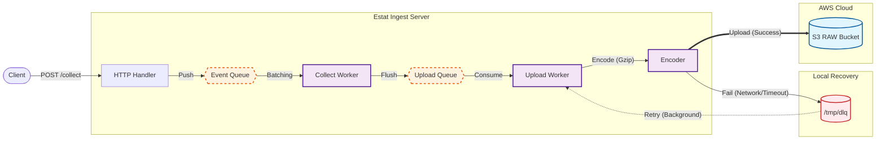
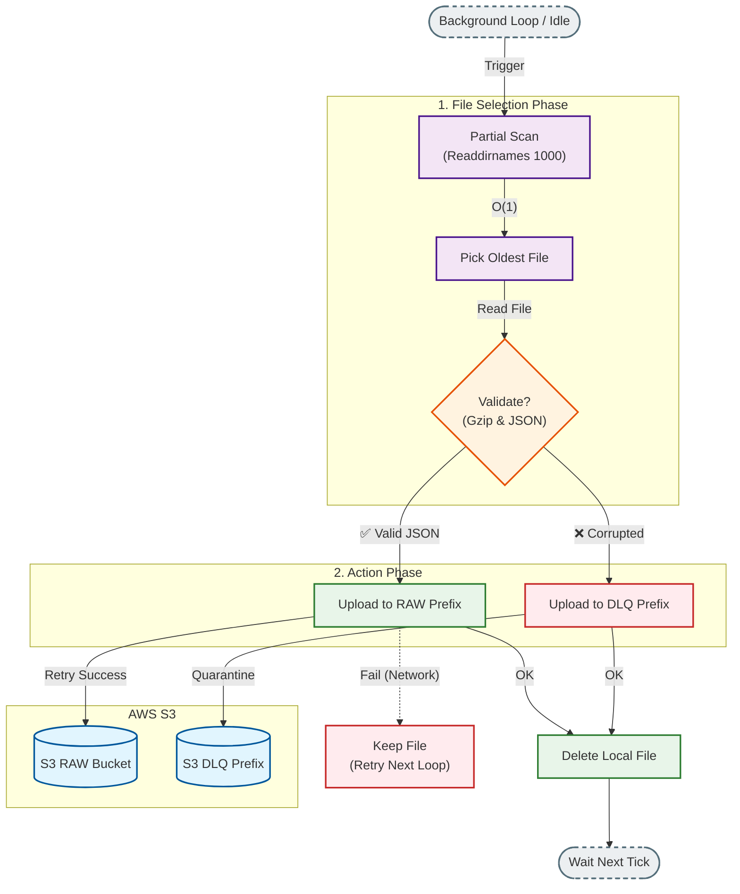
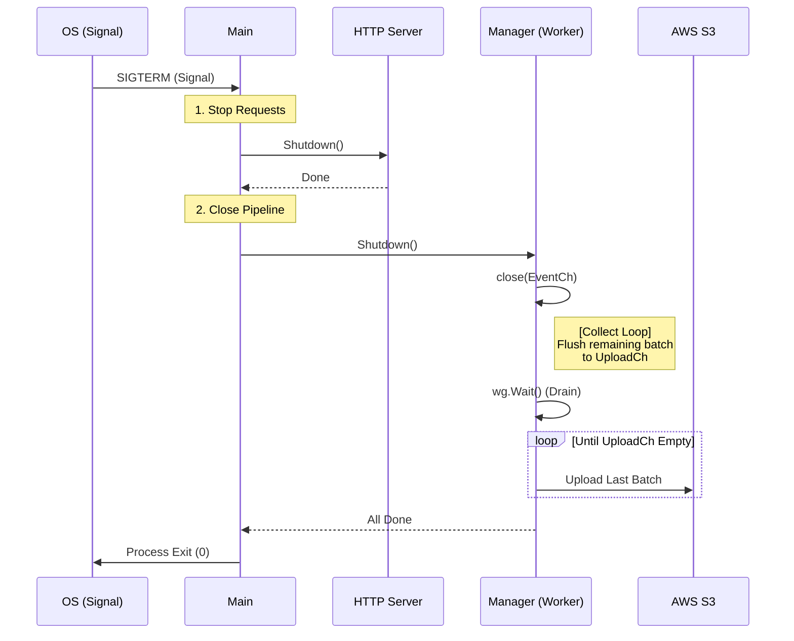

# Estat Ingest Server v1


고성능 · 무손실(Zero-loss)을 목표로 설계된 High Reliability AWS S3 기반 로그 Ingestion 서버

---

## 📌 1. 개요 (Overview)

**Estat Ingest Server**는 웹/앱 사용자 이벤트, 행동 로그 등을 대규모로 수집하여  
**AWS S3에 안정적으로 저장**하기 위한 초경량·고성능 Go 기반 Ingestion 서버입니다.

### 🧩 핵심 기능

- 수천 TPS 처리 가능 (Go concurrency + batching + gzip)
- S3 업로드 실패 대비 DLQ(Dead Letter Queue) 자체 구현
- Partial Scan (O(K)) DLQ 복구 알고리즘
- Graceful Shutdown → 배치 유실 0 보장
- Distroless 기반 안전한 런타임
- 메모리 재사용(`sync.Pool`) 기반 GC 최소화

---

## 🧱 2. 아키텍처 (Architecture Overview)

### 2.1 전체 데이터 파이프라인


---
## 🔁 3. 장애 복구 설계 (DLQ Recovery System)

S3 업로드 실패 → Local DLQ 저장 → Background 재업로드 로직은 다음 상태도로 표현됩니다:



---

## 🛑 4. Graceful Shutdown (Zero-loss Drain Pattern)



---

## 📁 5. 디렉토리 구조

```text
.
├── cmd/server/
│   └── main.go
├── internal/
│   ├── config/         
│   ├── metrics/        
│   ├── model/          
│   ├── pool/           
│   ├── server/         
│   └── worker/
│       ├── manager.go
│       ├── encoder.go
│       ├── s3_uploader.go
│       ├── dlq.go
│       ├── file_util.go
│       └── timecache.go
├── Dockerfile
├── Makefile
└── docs/
```

---

## ⚙️ 6. 환경변수 설정 (.env)

| ENV | 설명 | 예시 |
|-----|------|------|
| AWS_REGION | AWS 리전 | ap-northeast-2 |
| RAW_BUCKET | Raw 데이터 버킷 | estat-raw-data |
| RAW_PREFIX | Raw prefix | raw |
| DLQ_PREFIX | DLQ prefix | raw_dlq |
| HTTP_ADDR | HTTP 서버 주소 | :8080 |
| MAX_BODY_SIZE | 요청 최대 크기 | 16384 |
| CHANNEL_SIZE | EventCh 버퍼 크기 | 4000 |
| UPLOAD_QUEUE | UploadCh 버퍼 크기 | 4 |
| BATCH_SIZE | 배치 크기 | 5000 |
| FLUSH_INTERVAL | Flush 간격 | 120s |
| S3_TIMEOUT | S3 Timeout | 3s |
| S3_APP_RETRIES | S3 재시도 수 | 2 |
| DLQ_DIR | DLQ 폴더 | /tmp/dlq |
| DLQ_MAX_AGE | TTL | 24h |
| DLQ_MAX_SIZE_BYTES | 최대 용량 | 19327352832 |

---

## 📊 7. Metrics (노출 지표)

서버는 `/metrics` 엔드포인트를 통해 다음 텍스트 지표를 제공합니다.

| Metric | 의미 |
|--------|------|
| `http_requests_total` | `/collect`로 들어온 **모든 HTTP 요청 수** (성공/실패 포함, 시도 기준) |
| `http_requests_accepted_total` | EventCh에 **정상적으로 enqueue**된 요청 수 (실제 ingest 파이프라인에 들어간 요청) |
| `http_requests_rejected_body_too_large_total` | 요청 Body가 `MAX_BODY_SIZE`를 초과하여 413으로 거절된 요청 수 |
| `http_requests_rejected_queue_full_total` | EventCh가 가득 차서 **503으로 즉시 거절된 요청 수** (백프레셔 발생 지표) |
| `s3_events_stored_total` | 최종적으로 S3 **RAW prefix**에 저장된 **이벤트 수** (배치가 아니라 이벤트 단위) |
| `s3_put_errors_total` | S3 `PutObject` 호출 실패 횟수 (재시도 포함하여 증가) |
| `dlq_events_enqueued_total` | S3 업로드 실패로 인해 로컬 DLQ로 우회 저장된 **이벤트 수 누적 합** |
| `dlq_events_reuploaded_total` | DLQ에서 다시 S3로 업로드되어 **정상 복구된 이벤트 수** |
| `dlq_events_dropped_total` | DLQ 용량 초과 등으로 DLQ에 저장하지 못해 **버린 이벤트 수** |
| `dlq_files_expired_total` | TTL 또는 용량 정책에 의해 **삭제된 DLQ 파일 개수** |
| `dlq_files_current` | 현재 DLQ 디렉토리에 존재하는 DLQ 파일 개수 |
| `dlq_size_bytes` | DLQ 디렉토리의 전체 파일 크기(byte) 합계 (용량 사용률 모니터링용) |

## 🧪 8. 실행 방법

### 로컬 실행
```bash
make run-local
```

### Docker
```bash
make build
docker run estat-ingest:latest
```

### AWS ECR Push
```bash
make push
```

---

## 🚀 9. 성능 및 튜닝 팁

| TPS | BatchSize | 설명 |
|-----|-----------|------|
| ~500 | 5000 | 안정적 |
| ~1000 | 3000~5000 | 추천 |
| ~2000 | 2000~3000 | CPU 사용률 고려 |
| 3000↑ | 1000~2000 | gzip 부하 주의 |

---

## 🧱 10. 보안(Security)

- Distroless 런타임 사용
- Body 크기 제한
- ALB HTTPS Termination 가능
- X-Forwarded-For 기반 IP 추출

---

## 📚 11. 문서 모음 (docs/)

| 파일 | 내용 |
|------|------|
| docs/architecture.md | 아키텍처 상세 |
| docs/pipeline.md | Collect → Batch → Encode → Upload |
| docs/dlq.md | DLQ 설계 & Partial Scan |
| docs/shutdown.md | Graceful Shutdown |
| docs/tuning.md | 성능 튜닝 |
| docs/ops.md | 운영 전략 |

---

## 📘 12. 라이선스

MIT License
