# Estat Ingest Server v1

**High Performance · Resource Efficient · DLQ-based High Reliability**

Estat Ingest Server는 대규모 사용자 행동 로그를 실시간으로 수집하여  
**AWS S3에 안정적으로 적재**하기 위해 설계된 **초경량·고성능 Ingestion 서버**입니다.

- AWS Fargate(0.25~0.5 vCPU) 같은 제한된 환경에서도 고성능 처리
- JSONL + gzip + S3 업로드 파이프라인
- S3 장애 시 로컬 DLQ 기반 자동 복구 메커니즘 내장

---

## 📚 문서 네비게이션

전체 문서는 `docs/` 디렉토리에 정리되어 있습니다.

| 문서 | 설명 |
|------|------|
| [`docs/architecture.md`](docs/architecture.md) | 전체 시스템 구조 및 설계 철학 |
| [`docs/pipeline.md`](docs/pipeline.md) | Event → Batch → Encode → Upload 전체 파이프라인 |
| [`docs/dlq.md`](docs/dlq.md) | DLQ 저장·복구 전략, Partial Scan 알고리즘 |
| [`docs/shutdown.md`](docs/shutdown.md) | 안전한 종료(Drain Pattern) 설계 |
| [`docs/tuning.md`](docs/tuning.md) | TPS·CPU·메모리 기준 성능 튜닝 가이드 |
| [`docs/ops.md`](docs/ops.md) | 운영 모니터링·알람 기준·장애 대응 가이드 |

---

## 🚀 핵심 특징 (Key Highlights)

### 1. 리소스 효율적인 고성능 처리

- Goroutine + Channel 기반 파이프라인 구성
- `sync.Pool`을 적극적으로 활용해 GC 부담 최소화
- Fargate 0.25~0.5 vCPU 환경에서도 안정적으로 수천 TPS 처리 가능

### 2. 자연스러운 Backpressure

- EventCh(수집 큐)와 UploadCh(업로드 큐) 이중 큐 구조
- 업로드 병목 시 큐가 차오르며 **503 Fail-Fast** 동작으로 서버 보호
- 병목 지점이 어디인지 Metrics로 분명히 드러남

### 3. DLQ 기반 고신뢰성

- 업로드 실패 시 배치를 로컬 디스크(`/tmp/dlq`)에 저장
- 복구는 Partial Scan(O(K), K=1000) 기반 →  
  DLQ 파일 수가 수만·수십만 개여도 ingest 서버가 버티도록 설계
- 파일 유효성 검사 후:
  - 정상 파일 → S3 RAW Prefix 업로드
  - 손상 파일 → S3 DLQ Prefix(raw_dlq)로 격리

> **참고:** 네트워크·디스크·리소스가 완전히 고갈된 극단 상황에서는  
> 일부 이벤트가 유실될 수 있으나,  
> 가능한 범위에서 유실을 최소화하도록 설계된 구조입니다.

### 4. 안전한 종료 (Graceful Shutdown)

- SIGTERM 수신 → 순서 있는 Drain Pattern 적용:
  1. 새로운 요청 수신 중단
  2. EventCh 닫기 → CollectLoop 종료 및 잔여 배치 flush
  3. UploadCh 닫기 → UploadLoop가 남은 작업 모두 처리
- context 취소는 마지막에 수행하여 **중간 배치 유실 방지**

자세한 설명은 [`docs/shutdown.md`](docs/shutdown.md) 참고.

---

## 🧱 아키텍처 개요 (Architecture Overview)

아래 그래프는 ingest → batch → upload → DLQ 복구 전체 흐름을 요약한 구조입니다.

```mermaid
flowchart LR
    %% 스타일 정의
    classDef comp fill:#F3E5F5,stroke:#4A148C,stroke-width:2px;
    classDef buf fill:#FFF3E0,stroke:#E65100,stroke-width:1.5px,stroke-dasharray:5 5;
    classDef st fill:#E1F5FE,stroke:#01579B,stroke-width:2px;
    classDef fail fill:#FFEBEE,stroke:#C62828,stroke-width:2px;

    Client([Client]) -->|"POST /collect"| Handler[HTTP Handler]:::comp

    subgraph IngestServer [Estat Ingest Server]
        direction LR

        Handler -->|"Push"| EventCh{{EventCh}}:::buf
        EventCh -->|"Batching"| CLoop[CollectLoop]:::comp
        CLoop -->|"Flush"| UploadCh{{UploadCh}}:::buf
        UploadCh -->|"Consume"| ULoop[UploadLoop]:::comp

        ULoop -->|"Encode JSONL + Gzip"| Enc[Encoder]:::comp
        Enc -->|"PutObject"| Attempt{"S3 Success?"}

        Attempt -->|"Fail"| SaveDLQ[Save to Local DLQ]:::fail
        SaveDLQ --> DLQDir[("/tmp/dlq")]:::st

        DLQDir -.->|"Idle-Time Retry"| DLQMgr[DLQ Manager]:::comp
        DLQMgr -->|"Validate JSON"| Valid{"Valid?"}
    end

    subgraph AWS [AWS S3]
        S3Raw[(S3 RAW)]:::st
        S3Bad[(S3 DLQ Prefix)]:::st
    end

    Attempt -->|"Success"| S3Raw
    Valid -->|"Valid"| S3Raw
    Valid -->|"Corrupt"| S3Bad

    ULoop -.->|"Trigger Retry when Idle"| DLQMgr
```



---

## 📁 디렉토리 구조

```text
.
├── cmd/server/
│   └── main.go                  # 엔트리포인트
├── internal/
│   ├── config/                  # 환경변수 로드
│   ├── metrics/                 # 텍스트 기반 Metrics 노출
│   ├── model/                   # Event 모델
│   ├── pool/                    # sync.Pool 유틸
│   ├── server/                  # HTTP 서버, 핸들러, IP 파싱
│   └── worker/                  # Manager, Encoder, S3, DLQ 등 워커 로직
│       ├── manager.go
│       ├── encoder.go
│       ├── s3_uploader.go
│       ├── dlq.go
│       ├── file_util.go
│       └── timecache.go
├── docs/                        # 설계/운영 문서 모음
├── Dockerfile                   # Distroless 기반 이미지
└── Makefile                     # 빌드/배포 스크립트
```

---

## ⚙️ 실행 방법

### 1) 환경 변수 설정

예시:

```bash
AWS_REGION=ap-northeast-2
RAW_BUCKET=estat-raw-data
RAW_PREFIX=raw
DLQ_PREFIX=raw_dlq
HTTP_ADDR=:8080

MAX_BODY_SIZE=16384
CHANNEL_SIZE=4000
UPLOAD_QUEUE=4
BATCH_SIZE=5000
FLUSH_INTERVAL=120s

S3_TIMEOUT=3s
S3_APP_RETRIES=2

DLQ_DIR=/tmp/dlq
DLQ_MAX_AGE=24h
DLQ_MAX_SIZE_BYTES=19327352832
```

### 2) 로컬 실행

```bash
make run-local
```

### 3) Docker 이미지 빌드

```bash
make build
```

(필요 시 `make push` 로 ECR 등 레지스트리에 업로드)

---

## 📘 License

MIT License