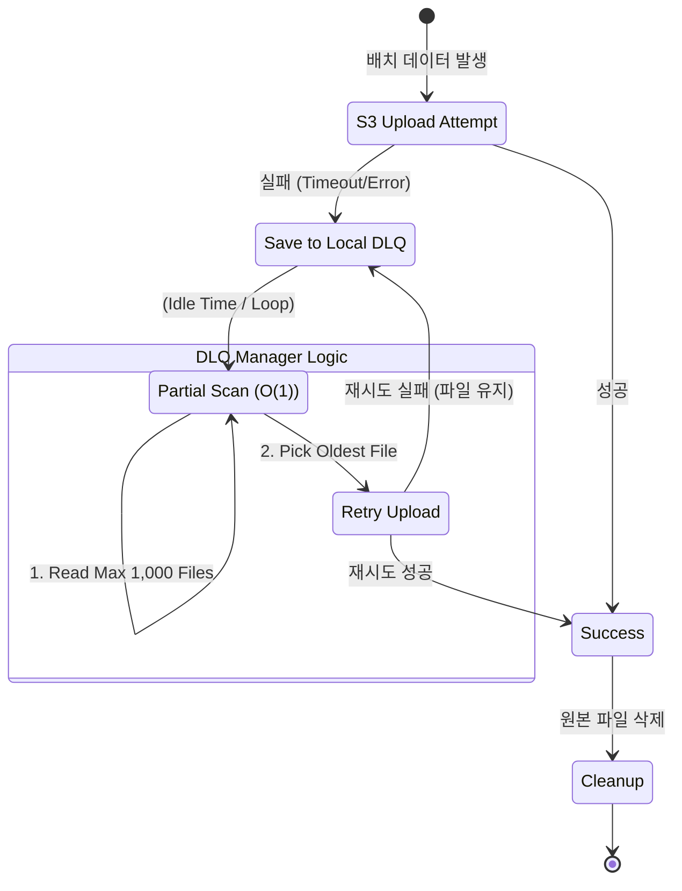
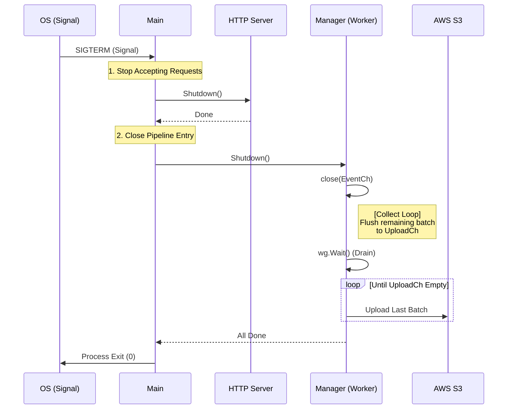

# Estat Ingest Server v1

**Estat Ingest Server**는 대규모 사용자 활동 로그를 실시간으로 수집하여 AWS S3로 적재하는 고성능 Ingestion 서버입니다. AWS Fargate(Container) 환경에 최적화되어 있으며, 장애 상황에서도 데이터 유실을 방지하는 강력한 복구 메커니즘을 갖추고 있습니다.

## 1\. 주요 특징 (Key Features)

  * **High Performance**: Go의 고루틴(Goroutine)과 채널(Channel)을 활용하여 적은 리소스로 수천 TPS의 트래픽을 안정적으로 처리합니다.
  * **Memory Efficiency**: `sync.Pool`을 적극적으로 사용하여 GC(Garbage Collection) 오버헤드를 최소화했습니다.
  * **Reliability (DLQ)**: S3 업로드 실패 시 로컬 디스크(Ephemeral Storage)에 데이터를 보관하고, 자동으로 재처리하여 데이터 유실을 방지합니다.
  * **Operational Safety**: **Partial Scan(부분 스캔)** 알고리즘을 적용하여 DLQ 파일이 수만 개 쌓여도 서버 성능 저하 없이 안정적으로 복구합니다.
  * **Graceful Shutdown**: 배포나 스케일인(Scale-in) 시 내부 버퍼에 남은 데이터를 모두 S3로 비워낸(Drain) 후 안전하게 종료합니다.

-----

## 2\. 시스템 아키텍처 (Architecture)

### 2.1 전체 데이터 파이프라인 (Data Pipeline)

클라이언트 요청부터 S3 적재까지의 데이터 흐름입니다. 서버는 \*\*"수집(Collect) - 배치(Batch) - 압축(Compress) - 적재(Upload)"\*\*의 4단계 파이프라인으로 동작합니다.

```mermaid
graph TD
    Client[Client / FE] -->|HTTP POST| Handler(Handler)
    
    subgraph "Ingest Server (Internal)"
        Handler -->|Validate & Parse| EventPool[sync.Pool<br/>(Event Reuse)]
        Handler -->|Push Event| EventCh{Event Channel<br/>(Buffer)}
        
        EventCh -->|Pop Event| Manager(Manager: Collect Loop)
        Manager -->|Batching<br/>(5000 events or 2m)| UploadCh{Upload Channel}
        
        UploadCh -->|Job| Uploader(Manager: Upload Loop)
        
        subgraph "Worker Processing"
            Uploader -->|1. Encode| Encoder[Gzip + JSONL]
            Uploader -->|2. Upload| S3Client
        end
    end

    S3Client -->|Success| S3[(AWS S3<br/>Raw Data)]
    S3Client -->|Fail| DLQ[(Local Disk<br/>DLQ)]
    
    DLQ -.->|Retry (Background)| Uploader
```

### 2.2 장애 복구 및 재처리 (Resilience Logic)

S3 장애 시 로컬 디스크를 버퍼로 활용하는 순환 구조입니다. **Partial Scan(O(1))** 알고리즘을 통해 파일이 무한히 쌓여도 서버가 멈추지 않도록 설계되었습니다.



### 2.3 안전한 종료 (Graceful Shutdown)

SIGTERM 신호 수신 시, **Drain Pattern**을 통해 유실 없이 종료하는 시퀀스입니다.



-----

## 3\. 핵심 기술 의사결정 (Technical Decisions)

### 🚀 Performance

  * **Sync.Pool**: `bytes.Buffer`, `gzip.Writer`, `Event` 객체를 풀링하여 메모리 할당과 GC 부하를 획기적으로 줄였습니다.
  * **GOMAXPROCS Control**: Fargate vCPU 환경(0.25\~0.5)에 맞춰 `GOMAXPROCS=1`로 제한하거나 환경변수로 튜닝하여, 과도한 컨텍스트 스위칭을 방지합니다.

### 🛡️ Reliability (DLQ Strategy)

  * **Partial Scan (O(1))**:
      * 기존의 `Readdir` (전체 스캔) 방식은 파일이 수만 개 쌓일 경우 CPU/IO 부하로 서버 다운을 유발할 수 있습니다.
      * 본 서버는 `Readdirnames(1000)`을 사용하여 파일 개수와 무관하게 **항상 일정량만 읽어 처리**하므로, 대량 장애 상황에서도 안정적인 복구가 가능합니다.
  * **Anti-Starvation**: 1,000개의 후보군 내에서 가장 오래된 파일을 우선 처리하며, 파일 시스템의 순환 구조 덕분에 모든 파일이 결국 처리됨을 보장합니다.

### ⚙️ Configuration

  * **S3 Retry Policy**: AWS SDK의 기본 Retry를 비활성화(0)하고, 애플리케이션 레벨에서만 제어하여 예측 불가능한 지연을 방지했습니다.

-----

## 4\. 환경 변수 설정 (Configuration)

`.env` 파일 또는 컨테이너 환경 변수로 설정합니다.

| 환경 변수 | 설명 | 기본값/예시 |
| :--- | :--- | :--- |
| `AWS_REGION` | AWS 리전 | `ap-northeast-2` |
| `RAW_BUCKET` | 데이터가 적재될 S3 버킷명 | `estat-raw-data` |
| `RAW_PREFIX` | S3 저장 경로 Prefix | `raw` |
| `DLQ_PREFIX` | 인코딩 실패 시 원본 저장 경로 | `raw_dlq` |
| `HTTP_ADDR` | 서버 포트 | `:8080` |
| `MAX_BODY_SIZE` | 요청 바디 최대 크기 (Bytes) | `16384` (16KB) |
| `CHANNEL_SIZE` | 내부 이벤트 채널 버퍼 크기 | `4000` |
| `BATCH_SIZE` | S3 업로드 단위 (이벤트 수) | `5000` |
| `FLUSH_INTERVAL` | 배치 강제 업로드 주기 | `120s` |
| `S3_TIMEOUT` | S3 업로드 타임아웃 | `3s` |
| `S3_APP_RETRIES` | 업로드 재시도 횟수 | `2` |
| `DLQ_DIR` | 로컬 DLQ 저장 경로 | `/tmp/dlq` |
| `DLQ_MAX_AGE` | DLQ 파일 보관 기한 (TTL) | `24h` |
| `DLQ_MAX_SIZE_BYTES` | DLQ 최대 허용 용량 | `19327352832` (18GB) |

-----

## 5\. 모니터링 지표 (Metrics)

`/metrics` 엔드포인트에서 텍스트 형식으로 제공됩니다.

| 지표 (Metric) | 설명 | 중요도 |
| :--- | :--- | :--- |
| `http_requests_total` | 전체 수신된 HTTP 요청 수 | Info |
| `http_requests_accepted_total` | 정상적으로 큐에 적재된 요청 수 | **High** |
| `http_requests_rejected_queue_full_total` | **[위험]** 내부 큐가 꽉 차서 드랍된 요청 수 (503) | **Critical** |
| `s3_events_stored_total` | S3에 최종 저장 성공한 이벤트 수 | **High** |
| `s3_put_errors_total` | S3 업로드 실패 횟수 | Warn |
| `dlq_events_enqueued_total` | DLQ(로컬)로 우회 저장된 이벤트 수 | Warn |
| `dlq_events_dropped_total` | **[위험]** DLQ 용량 초과로 영구 유실된 수 | **Critical** |
| `dlq_files_current` | 현재 DLQ에 쌓여있는 파일 개수 | Warn |

-----

## 6\. 실행 방법 (Usage)

### 로컬 실행

```bash
# 의존성 설치 및 실행
make run-local
```

### 도커 빌드

```bash
# Docker Image 빌드
make build

# ECR Push (설정 필요)
make push
```

### 디렉토리 구조

```text
.
├── cmd/server/       # 메인 엔트리포인트 (main.go)
├── internal/
│   ├── config/       # 환경 설정 로드
│   ├── metrics/      # 운영 지표 관리
│   ├── model/        # 데이터 구조체 (Event)
│   ├── pool/         # 메모리 풀 (sync.Pool)
│   ├── server/       # HTTP 핸들러 & IP 파싱
│   └── worker/       # 핵심 로직 (Manager, S3, DLQ, Encoder)
├── Dockerfile        # Distroless 기반 경량 이미지
└── Makefile          # 빌드 스크립트
```